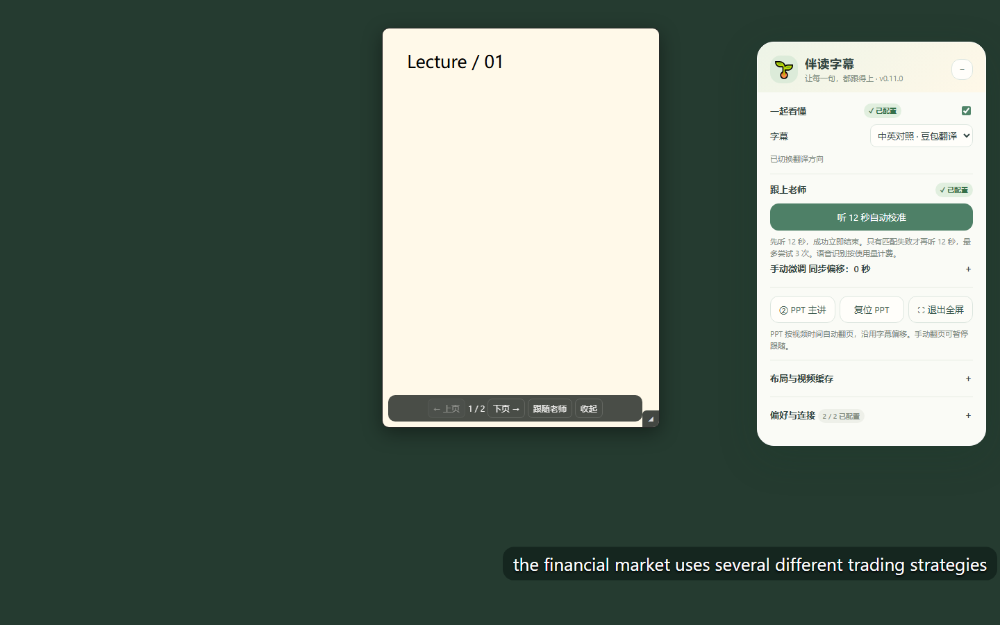

# 🌱 伴读字幕 · 智云课堂

为智云课堂回放添加同步字幕、豆包翻译和可缩放 PPT 悬浮窗。纯油猴脚本，无需启动本地服务。



## v0.11.0 更新

布局按钮可连续点击，依次切换：**左右并排 → PPT 主讲（右下角小视频，字幕在 PPT 下方）→ 恢复课堂**。PPT 保留自由拖动、四边缩放及复位；「布局与视频缓存 → 调整视频 / 字幕」可设置视频位置、宽高，以及字幕位置、宽度。切换布局不替换视频源。

校准开始时自动临时切到 1 倍速，结束或取消后恢复原倍速。首次成功立即停止；仅匹配失败才继续下一段，最多三段。采音遇到 `waiting` 缓冲事件时丢弃不完整片段，收到 `playing` 后重新采音，不重复提交损坏片段。主动暂停、拖动进度、换课或取消会停止校准。缓冲重启最多 10 次，单次等待最多 2 分钟，防止无限等待。

### 浏览器缓存（有适用范围）

在「布局与视频缓存」点击「缓存当前视频」，完整下载到浏览器 IndexedDB 后，再点击「播放已缓存视频」。也可导入平台已经下载的 MP4/WebM。缓存播放使用同一个网页视频元素，尝试保留当前位置与倍速；有「恢复在线视频」及「清除此课缓存」。

- 当前只支持地址明确为 MP4/WebM 且浏览器可读取的文件，单个最多 **512 MB**。浏览器存储空间不足时会报错。
- **不支持直接缓存 HLS/DASH 分片流、MSE 的 blob 地址、受跨域限制或加密的资源。** 此时提示使用平台下载并导入；不是全站通用离线方案。
- 缓存完整下载前不会加速当前播放。需要保留课程页面以使用字幕和 PPT；视频数据本地播放不等于整站离线可用。
- 缓存在此浏览器的课程网站存储中，浏览器清理站点数据可能将其删除。不会上传本地导入的视频。
- 已使用模拟媒体字节验证存储、读取、切换来源、恢复及清除；尚未对真实课堂大文件、编码解码和网站播放器的缓存播放做端到端验收。

语言检测仍会跳过明确属于目标语言的字幕，复杂混合语言可能判断不准。

## 功能

- 将右侧已加载的语音识别字幕同步显示在视频下方，支持字号、位置和提前 / 延后调整。
- 一个下拉框切换原文与中英对照；选择中英对照后开启豆包按需翻译。
- 采集 12 秒视频音轨自动匹配字幕时间，第一次匹配成功立即结束；仅匹配失败时继续下一段，最多三段，可查看进度、随时取消。
- PPT 悬浮窗可拖动、拖右下角缩放，记住位置、大小与页码。支持跟随老师自动翻页，沿用字幕偏移。
- 支持容器全屏、设置面板收起、已加载字幕导出 SRT。

## 安装

1. 安装 Tampermonkey，并在浏览器扩展设置中允许用户脚本运行。
2. 打开 [脚本安装地址](https://raw.githubusercontent.com/FILAgiao/zhiyun-subtitles/main/zhiyun-subtitles.user.js)，按提示安装；也可在油猴中新建脚本，完整粘贴本仓库 JS 内容后保存。
3. 刷新智云课堂回放，打开右侧「语音识别」。面板版本应为 **v0.11.0**。
4. 「偏好与连接」可分别填写翻译 Key 和语音 Key。绿色勾表示已保存，不代表接口权限已经验证。

仅使用字幕显示、手动偏移或 PPT 悬浮窗时，无需 API Key。

## 翻译与语音

翻译使用火山方舟 Responses 接口，模型 `doubao-seed-translation-250915`。选择「中英对照 · 豆包翻译」开启请求，选择「仅原文」停止；刷新后默认原文。

语音校准使用 `openspeech.bytedance.com/api/v3/auc/bigmodel/submit` 和 `/query`，资源 `volc.seedasr.auc`，填写语音服务的 `x-api-key`。校准前播放视频并加载字幕列表；脚本会临时调整倍速。识别失败、取消或匹配不可靠时保留原偏移；它是局部偏移校准，不是全课逐字对齐。

Key 仅保存在油猴脚本存储中，不包含在仓库中。翻译会发送当前及后续少量字幕；校准会发送采集的视频音轨，不使用麦克风。两项服务可能产生 API 费用，取消浏览器等待不保证取消云端任务。不要把 Key 写进脚本或发到 GitHub Issues。

## PPT 与全屏

拖动 PPT 图片自由移动，拖右下角缩放，可跨越初始左右分区。悬停或键盘聚焦时显示翻页与跟随按钮。手动翻页暂停自动跟随，再次打开保留页码；开启跟随时按当前视频时间同步。

自动翻页依赖页面已加载的 PPT 时间戳。全屏请使用脚本的「专注全屏」；原生的仅 video 元素全屏不能显示外部 HTML 控件。PPT 图片保持原比例，空白区域使用黑色背景。

## 使用范围与限制

- 针对 `interactivemeta.cmc.zju.edu.cn` 回放页面的现有 DOM 实现，网站改版可能需要适配。
- 字幕导出仅包含已加载内容，结束时间由下一条字幕和最长显示时间估算。
- 浏览器或视频跨域限制可能阻止音轨采集。
- 使用者需自行拥有课程访问权限及相应服务权限；脚本不绕过登录或访问控制。

## 开发与测试

需要 Node.js 18 或更高版本。

```sh
npm test
npm install
npx playwright install chromium
npm run test:ui
```

`npm test` 运行无外部依赖的 24 项单元测试。UI 测试使用模拟课堂、虚拟凭证和模拟接口，验证字幕状态、PPT 翻页与跟随、窗口拖拽缩放、全屏、进度和取消，不调用真实云端服务。测试生成 `ui-preview.png`。

可用 `PLAYWRIGHT_MODULE` 指定已有 Playwright 模块路径，或用 `PLAYWRIGHT_EXECUTABLE_PATH` 指定 Chromium 可执行文件。
