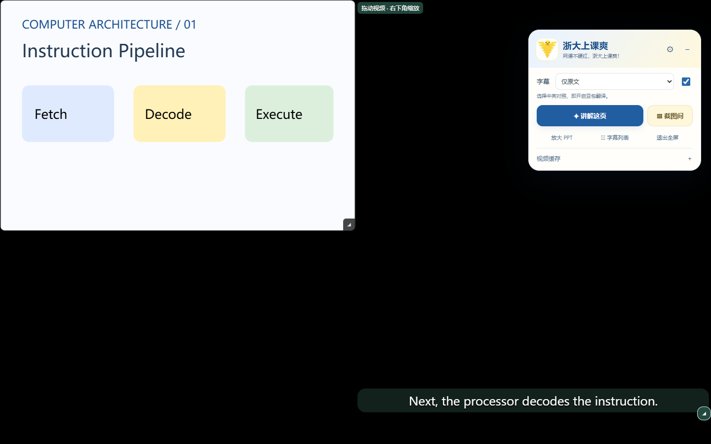

# 浙大上课爽

**网课不硬扛，浙大上课爽！**

给智云课堂回放加上同步字幕、PPT 讲解和本机缓存。打开课堂就能用；配置藏在设置里，需要时再调。

**[点击安装 / 更新油猴脚本](https://raw.githubusercontent.com/FILAgiao/zhiyun-subtitles/main/zhiyun-subtitles.user.js)** · [品牌、备选标语与功能清单](产品与品牌说明.md) · [问题反馈](https://github.com/FILAgiao/zhiyun-subtitles/issues)



## 安装与更新

1. 安装并启用 Tampermonkey，在浏览器扩展设置中允许用户脚本运行。
2. 点击上面的安装链接，按油猴提示安装。旧用户请核对更新后只启用一份脚本，避免旧名称脚本同时运行。
3. 刷新智云课堂回放，打开网站右侧“语音识别”以加载字幕。设置中版本应为 **0.17.0**。
4. 字幕、PPT 和手动同步无需 Key；双语翻译和 AI 讲解在设置 → API 连接填写自己的豆包 Key。

脚本包含 `@updateURL` / `@downloadURL`：油猴读取轻量的 `.meta.js` 检查版本，再下载完整 `.user.js`。首次安装后按照油猴自己的检查周期更新，也可以在油猴管理面板手动检查。详见 [Tampermonkey 官方说明](https://www.tampermonkey.net/documentation.php?locale=zh_&q=update_url)。

## 四件事，直接上手

| 想做什么 | 操作 |
| --- | --- |
| 正常看课 | 主面板选择原文或双语；空格播放/暂停，左右前后 10 秒 |
| 看清内容 | “看 PPT”“字幕列表”“课堂全屏”；PPT 可拖动和缩放 |
| 看不懂这页 | “讲解这页”，或“截图问”；支持字幕中键取词、连续追问、费曼/专业/复习模式 |
| 提前备好视频 | 展开“视频缓存”，准备 10 / 20 分钟；就绪后默认自动接续本机播放 |

画面布局、时间微调、术语表、模型和连接信息集中在分类设置。输入文字时不会抢播放快捷键；PPT 聚焦时左右键翻页。AI 回答之后可保存本地知识卡。

## 0.17.0 改了什么

- **更清楚的界面**：统一品牌与标语；主要操作围绕字幕、讲解、截图。校准和布局细节移进设置，缓存按需展开。
- **播放与全屏**：缓存使用原生视频控制条，隐藏已适配的网站重复控制条；课堂全屏保留字幕、PPT 和可打开的字幕列表。
- **缓存与 Chrome**：存储改为纯数据定位信息，避开本机 Chrome 153 读取 IndexedDB 文件系统句柄时的进程崩溃。旧缓存保留，恢复方式见下方。
- **缓存反馈与删除**：显示读取索引、准备片段、后台补齐等阶段及实际进度；停止写入后再删除文件，避免看似删除却仍在写入。
- **翻译更有上下文**：术语增强模式结合每侧默认 12 句、课程背景及术语表，仍只输出当前句；可切回逐句省流。选择双语才开始付费模型请求。
- **统一时间**：PPT 和字幕共用分段同步点，处理不同课堂位置的漂移。定时校准默认关闭，手动微调立即接管并取消自动任务。
- **AI 理解课程**：当前 PPT 讲解、框选/粘贴截图、多轮文字对话、解释模式与知识卡；翻页上下文可选，翻页本身不请求模型。

## 缓存与旧数据

缓存支持已授权、可访问的普通未加密 MP4；完整缓存也支持 WebM。分段缓存使用 MP4 索引确定可播放时间，不用文件百分比推算。10 / 20 分钟指课程时长，不是承诺的下载等待时间。

新版本不把文件夹句柄写进 IndexedDB。默认浏览器存储按名称重新定位；自选文件夹在刷新后需要重新选择。旧数据库不自动删除；Chrome 153 不直接读取旧记录以避免崩溃。设置中的旧缓存恢复入口说明可恢复范围，无法确定归属的旧分段保留，不自动拼接或覆盖。

保留课程标签页才能继续下载；清理浏览器站点数据可能删除默认缓存。已保存视频不等于整个课堂网站可离线打开。HLS/DASH、加密视频或浏览器不支持的编码不在当前适配范围。

## AI、凭证与费用

翻译与讲解共用用户保存在油猴中的豆包 Key，默认讲解/增强翻译模型为 `doubao-seed-2-1-lite-260915`，讲解模型可在设置中修改。示例中的 `$ARK_API_KEY` 是环境变量占位符，项目没有附带实际密钥。

AI 只在提问时发送相关文本/图片，联网搜索默认关闭；知识卡仅在本机生成，不自动上传。定时语音校准使用独立语音服务凭证。当前没有实时语音对话、充值或支付；方案见 [UX-DESIGN.md](UX-DESIGN.md)，接口与数据范围见 [AI-LEARNING.md](AI-LEARNING.md)。

## 开发与验证

```sh
npm ci
npm run build
npm test
npm run test:ui
npm run test:cache
npm run test:stream
npm run test:storage
npm run test:release
```

本次验证通过：49 项单元测试、7 套界面回归、2 套缓存流程回归、Chrome 153 的真实缓存刷新/解码/删除、Edge 的旧句柄迁移及事务回滚，以及真实 MP4 头部/尾部索引和分段播放。

浏览器回归可通过 `PLAYWRIGHT_EXECUTABLE_PATH` 指定本机 Chrome / Edge / Chromium。旧句柄迁移测试默认使用本机 Edge，也可设置 `STORAGE_MIGRATION_BROWSER` 指向能够安全读取旧句柄的浏览器。真实媒体测试先运行 `npm run test:media` 生成测试视频。缓存引擎、界面、播放器交互和 AI 模块在构建时内联进脚本，安装后不依赖远程模块加载。

测试使用模拟课堂、自生成 MP4 和模拟云端响应；没有访问用户登录课堂或消费真实云端 API 额度。测试结果不代表所有课堂来源和长期浏览器运行均已验收。

求是蓝和小黄鹰用于个人学习工具的视觉表达，**非浙江大学官方产品**。历史记录见 [CHANGELOG.md](CHANGELOG.md)，MP4Box.js 许可见 [THIRD_PARTY_NOTICES.md](THIRD_PARTY_NOTICES.md)。
